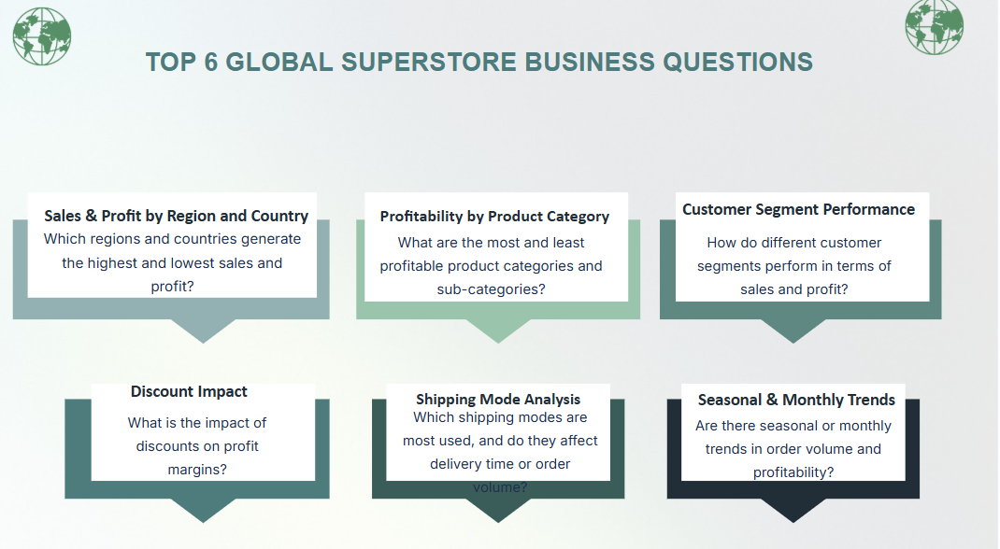
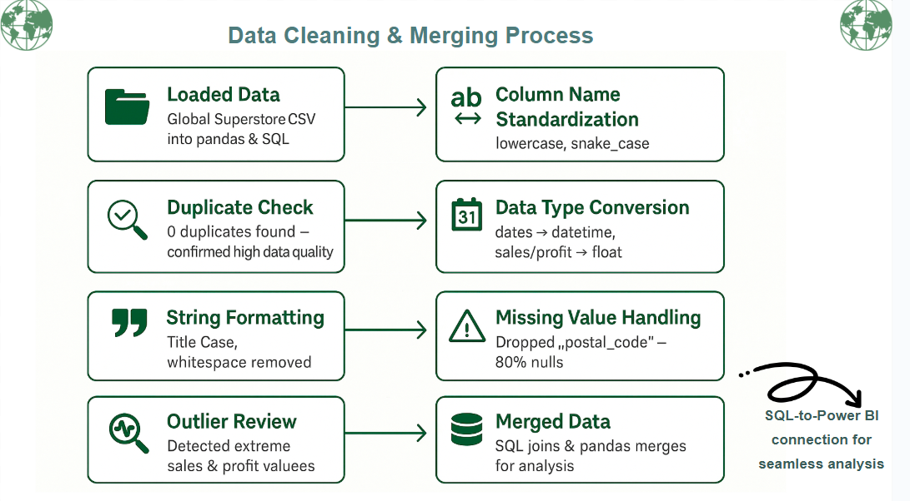
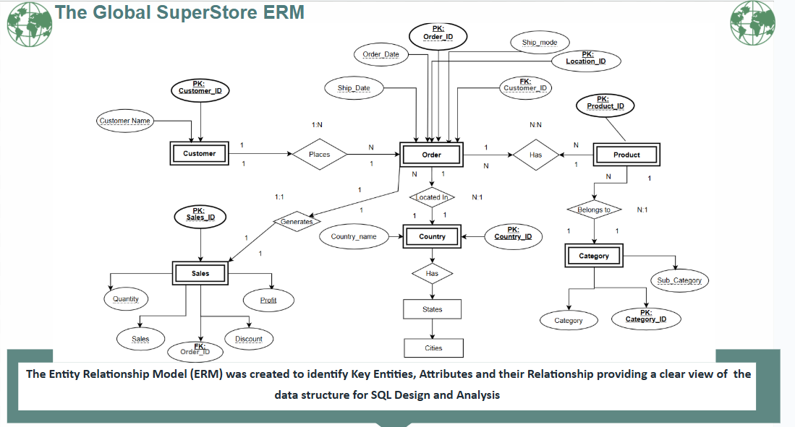
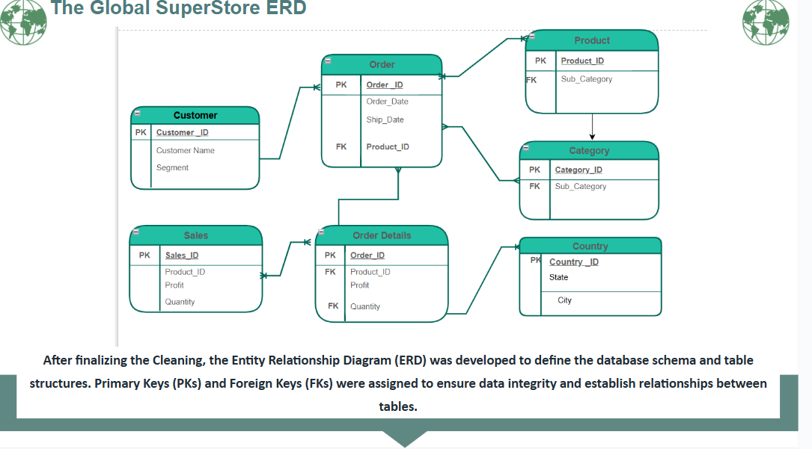
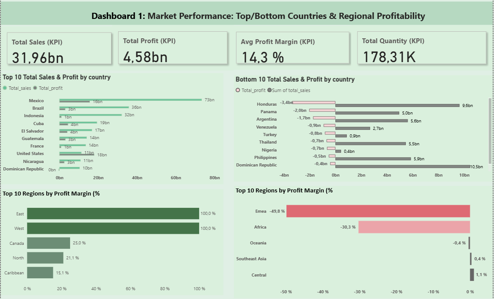
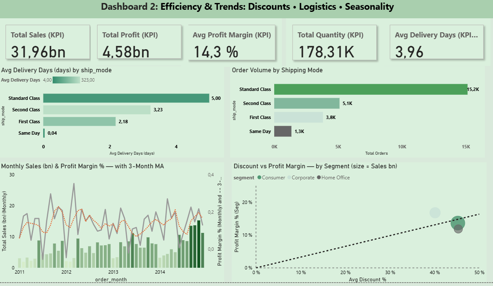
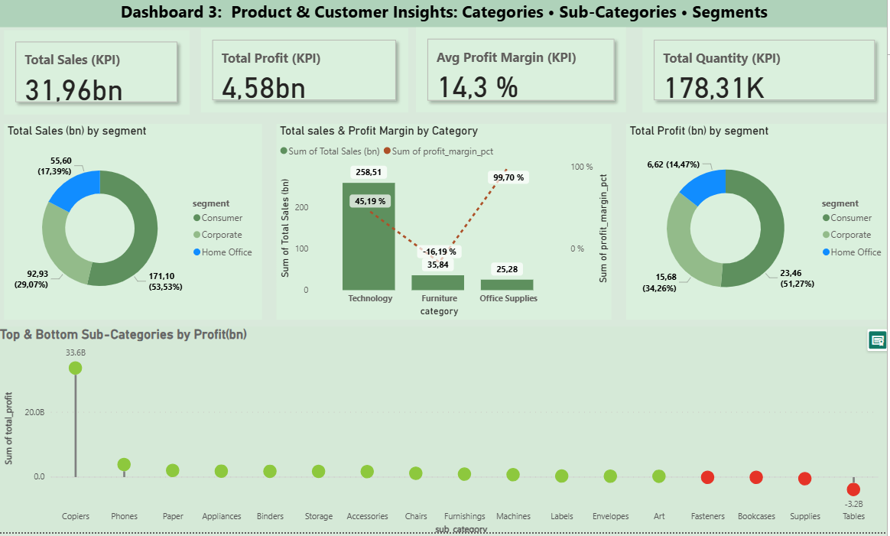
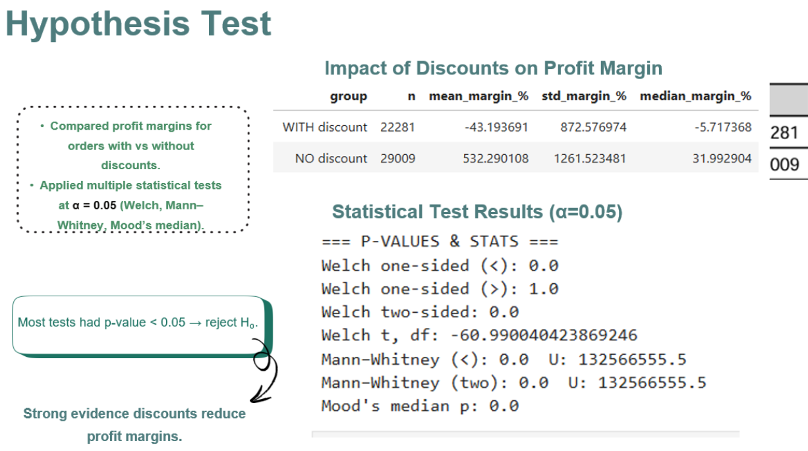

#  The Global Superstore Analysis  

*"Retail is no longer local, it’s a global battlefield."*  

This project transforms the Global Superstore dataset into clear, data-driven business insights, to uncover patterns in sales, profit, discounts, and shipping efficiency.
It combines **data cleaning and ER modeling**, **descriptive analytics**, **statistical testing**, and **interactive dashboarding** to provide actionable business insights.
, the goal is to answer real-world retail questions and highlight where growth, risks, and opportunities lie.  

---

##  Preview  

### Business Questions  
Every project starts with the right questions. Here we defined what matters most: sales, profit, customers, and markets.  
  

### Data Cleaning Process  
Raw data isn’t ready for insight. We cleaned and prepared the Global Superstore dataset so analysis could be accurate and trustworthy.  
  

### Entity Relationship Models  
Before analysis, we designed the structure. The ERM shows relationships at a high level, and the ERD details how tables connect.  

**ERM**  
  

**ERD**  
  

### Power BI Dashboards  
We translated the analysis into dashboards that tell the story visually.  

**1. Market Insights** – Which regions and markets drive the most growth?  
  

**2. Efficiency & Operations** – How well do shipping modes and delivery times perform?  
  

**3. Product Performance** – Which categories and subcategories are most profitable?  
  

### Hypothesis Testing  
To go beyond dashboards, we tested assumptions with statistical methods, adding depth to the business insights.  
  

##  Tools & Technologies
- **Power BI** – KPI dashboards & visual analytics
- **Python** – Data cleaning, EDA, hypothesis testing
- **SQLite** – Database creation & SQL queries
- **Excel** – Initial exploration & data checks

##  Key Dashboards
1. **Market Performance:** Top/Bottom countries, regional profitability
2. **Efficiency & Trends:** Shipping, discounts, seasonality
3. **Product & Customer Insights:** Categories, sub-categories, segments

## Hypothesis Testing
- **Test:** Profit margin difference between orders with and without discounts
- **Result:** Large negative impact of discounts on profitability
- **Effect Size:** Hedges’ g = -0.531 (large), Cliff’s delta = -0.590 (large negative)

##  Key Insights
- Large **regional variability** in profitability  
- **Discounts significantly reduce profit margins**  
- High-profit categories: Technology & Office Supplies; Loss-making: Tables  
- **Standard shipping dominates**, but delivery times vary widely  
- Corporate segment generates highest profits despite fewer orders

##  Recommendations
- Reassess **pricing & discount strategy**
- Optimize **product mix** in loss-making categories
- Improve **logistics efficiency** in slower shipping modes
- Focus marketing on **high-margin regions & segments**
- Phase out or reprice unprofitable sub-categories

##  Folder Structure

/GlobalSuperstore-Analysis
│── data/                 # Dataset files
│── notebooks/            # Python EDA & analysis
│── dashboards/           # Power BI files
│── images/               # Screenshots & charts
│── README.md              # Project documentation

##  Project Files

-  **Notebook** → [Open analysis.ipynb](./notebooks/1_data_loading_preview.ipynb)  
-  **Power BI Dashboard** → [Download Final_Project_Dashboard.pbix](./Powerbi%20dashboard/Final_Project_Dashboard.pbix)  
-  **Presentation** → [Download PowerPoint (.pptx)](./Presentation/A%20journey%20through%20the%20Global%20Economy%20(1)%20(1).pptx)  
                      (https://docs.google.com/presentation/d/1DsdYUjyjQjNTQVWSHFW5C4xvO2wGCCL1/edit?slide=id.p1#slide=id.p1 )

##  Author
**Egbe** – Data Analyst  
GitHub: [https://github.com/Egbe34]  

Trello (https://trello.com/b/Eh8xoOw9/final-project-global-superstore-analytics)
Presentation (https://docs.google.com/presentation/d/1DsdYUjyjQjNTQVWSHFW5C4xvO2wGCCL1/edit?usp=sharing&ouid=101322982193861291493&rtpof=true&sd=true )
